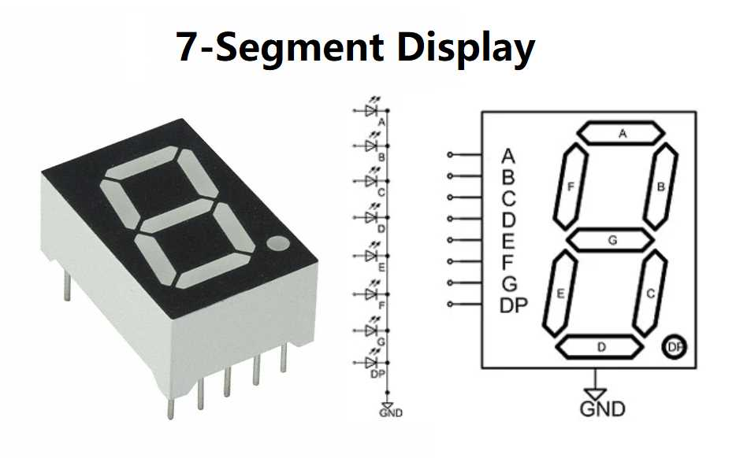
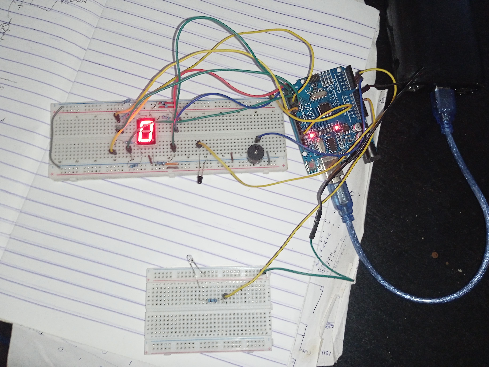
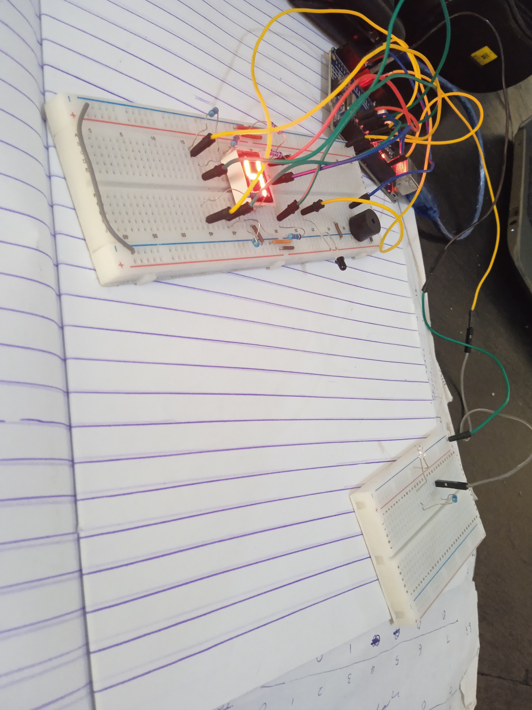

DESCRIPTION
-----------
This project is a conveyor belt item counter used for counting items being passed on a conveyor belt. 
The project makes use of an infrared (IR) beam to detect items passing by breaking and making of the beam path.
The IR beam is produced by an infrared-emitting diode.
The beam is sensed by a phototransistor that detects radiation in the Infrared spectrum.
When an item passes, the beam is broken and made which provides an input signal to the controller. 
With this, the number of items counted are recorded continuously and displayed via a Seven-Segment Display. 
A buzzer also beeps whenever an item is detected. 

This demo only counts up to nine items, but the project could be expanded to display more. 

SIGNAL FLOW/BLOCK DIAGRAM
-------------------------
[Beam-break detection] --------> [Controller] ----------> [Seven-segment Display]
                                               |
                                               |
                                               |---------> [Buzzer]
         

CIRCUIT SCHEMATIC
-----------------
Input
[
    PC1 -> Collector of IR phototransistor 
] 

Output
[
    PC0 -> Buzzer +ve terminal 
    PD1 -> Seven-Segment Display 'a' pin
    PD2 -> Seven-Segment Display 'b' pin
    PD3 -> Seven-Segment Display 'c' pin
    PD4 -> Seven-Segment Display 'd' pin
    PD5 -> Seven-Segment Display 'e' pin
    PD6 -> Seven-Segment Display 'f' pin
    PD7 -> Seven-Segment Display 'g' pin
]                     

DEMONSTRATIONS
--------------

Image demos: 

Video demo: 

